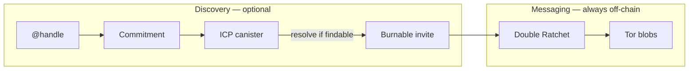

# horus-username-registry

Privacy-first **`@` usernames** for Horus.

**Messages never go on-chain.** The registry is an optional **discovery lock**: someone who already knows `@you` can resolve a **burnable invite**, not a permanent public-key directory.

| Path | Role |
|------|------|
| [`registry/`](registry/) | Rust crate `horus-registry` — nullifier, commitment, rate limit, stake stub |
| [`canister/`](canister/) | ICP Motoko service exposed via `*.raw.icp0.io` |
| [`docs/design.md`](docs/design.md) | Design notes for operators & reviewers |

| | Links |
|---|--------|
| Narrative docs | [private-usernames.md](https://github.com/horus-chat/horus/blob/main/docs/private-usernames.md) |
| Protocol FFI | [ffi.md](https://github.com/horus-chat/horus/blob/main/docs/ffi.md) (`horus_registry_*`) |
| Docs hub | [horus-chat/horus](https://github.com/horus-chat/horus) |

**License:** MIT · **Audit:** not independently audited

---

## Put it in perspective

| Plane | Where | Holds |
|-------|-------|-------|
| Messaging | Tor + Double Ratchet | Ciphertext sessions keyed by **invite id** |
| Discovery (optional) | This registry | Nullifier + commitment (+ optional invite blob) |



Claiming or renaming `@` does **not** move, rename, or delete existing chats. Reinstall = new identity; we cannot restore keys.

---

## What the registry may / must not hold

| May hold | Must not hold |
|----------|----------------|
| Nullifier (uniqueness token for a name) | Message bodies |
| Commitment binding name + salt + findable flag | Long-term pubkey directory for scraping |
| Optional findable **invite blob** | Your onion as a permanent public map |
| Owner lock / rate-limit metadata | Advertising IDs, phone numbers |

Salt that lets you update the lock later stays on the **phone**.

---

## Rust crate (`registry/`)

In-memory / testable logic used by [horus-dev-relay](https://github.com/horus-chat/horus-dev-relay) for local labs, and mirrored conceptually by the Motoko canister.

```bash
cargo test --manifest-path registry/Cargo.toml
```

Sibling layout for the dev relay:

```text
horus-workspace/
  horus-username-registry/
  horus-dev-relay/          # path = ../horus-username-registry/registry
```

### Core operations

| Operation | Meaning |
|-----------|---------|
| `claim(username, salt, findable, contact?)` | Reserve `@name`; contact required if findable |
| `resolve(username)` | Invite blob if findable; else none |
| `is_taken` / nullifier checks | Availability |
| Rate limiter / stake stubs | Abuse friction |

Domain-separated hashes use `horus-nullifier-v1` / `horus-commit-v1` prefixes (see `registry/src/lib.rs`).

---

## ICP canister (`canister/`)

Motoko service (Candid sketch):

```candid
claim : (text, text, bool, opt text) -> (Result);
isTaken : (text) -> (bool) query;
resolve : (text) -> (opt text) query;
```

Phones call ICP’s **public HTTP gateway** (`https://<canister_id>.raw.icp0.io`) — no Horus chat VPS required for discovery.

```bash
cd canister
./deploy.sh            # local replica
./deploy.sh mainnet    # spends cycles — confirms interactively
```

Details: [canister/README.md](canister/README.md) · Design: [docs/design.md](docs/design.md)

**Do not** commit `.dfx` / `.icp` identities, controllers, or cycle wallets.

---

## Client integration

From [horus-protocol](https://github.com/horus-chat/horus-protocol) FFI:

- `horus_registry_claim`  
- `horus_registry_resolve`  
- `horus_registry_taken`  

Pass the registry base URL from client config. After a resolve, the contact blob is typically a **burnable invite** — continue with normal [message flow](https://github.com/horus-chat/horus/blob/main/docs/message-flow.md).

---

## Security honesty

- `@taken` is usually visible (uniqueness). That is OK; it must not reveal onion/device.  
- A public invite blob (findable mode) is as sensitive as posting an invite link — TTL/burn still apply.  
- ZK / PIR search is aspirational in the long design notes; v1 is intentional reveal of a known name.  
- Not independently audited.

Report issues: [SECURITY.md](SECURITY.md).

---

## Related

| Repo | Role |
|------|------|
| [horus-protocol](https://github.com/horus-chat/horus-protocol) | Claims/resolves via FFI |
| [horus-dev-relay](https://github.com/horus-chat/horus-dev-relay) | In-memory registry for labs |
| [horus](https://github.com/horus-chat/horus) | Full documentation |

## License

MIT — [LICENSE](LICENSE).
