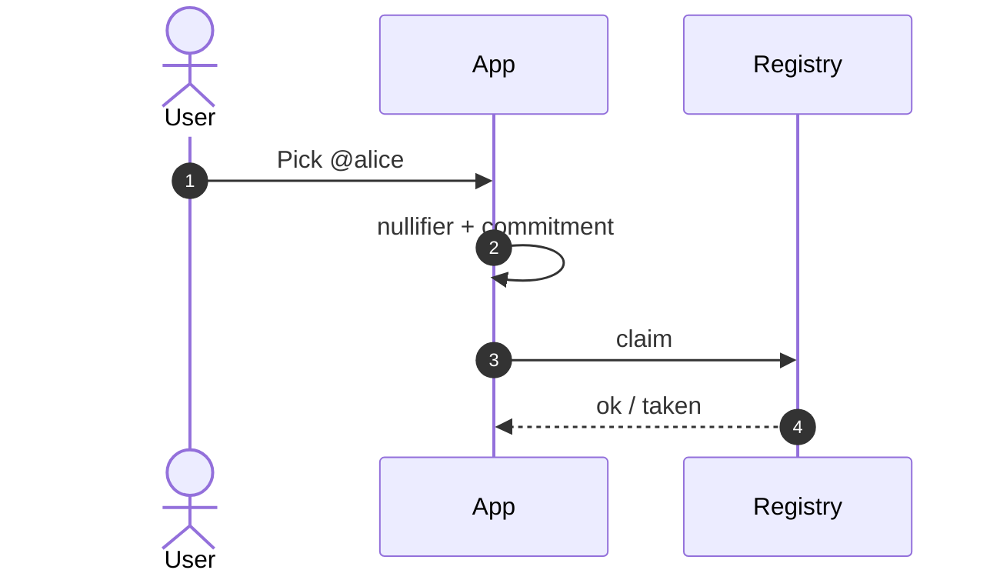

# Username registry design notes

Companion to the repo [README](../README.md) and the narrative doc  
[private-usernames.md](https://github.com/horus-chat/horus/blob/main/docs/private-usernames.md).

## Goals

1. Telegram-like `@search` **without** a global plaintext map `username → identity key`.  
2. Uniqueness of names.  
3. Optional “findable” mode that returns a **burnable invite**, not a permanent endpoint.  
4. Keep **all chat ciphertext** off-chain (Tor + Double Ratchet).

## Non-goals

- Recovering a lost phone via the registry  
- Publishing onions next to usernames  
- Storing messages, receipts, or social graphs on ICP  

## Commitment sketch (implemented shape)

Device-side (simplified):

1. Normalize username `u`.  
2. `nullifier = H("horus-nullifier-v1" ‖ u)` — uniqueness tag.  
3. `commitment = H("horus-commit-v1" ‖ u ‖ salt ‖ findable ‖ contact?)`.  
4. Publish nullifier + commitment (+ optional contact) to canister / lab relay.  
5. Keep `salt` on device for later updates.

## Resolve

If `findable` and a contact blob is stored, `resolve` returns that blob (typically `horus://invite/…`).  
Caller then runs normal invite redeem + Accept. If not findable, resolve is empty — name may still show as taken.

## Threat notes

| Observer | Should learn |
|----------|----------------|
| Chain scraper | That some nullifiers exist; not your Tor mailbox |
| Someone who types `@alice` | Invite blob **only if** you opted findable |
| Registry operator / ICP | Same public data — still no chat plaintext |

“Encrypt the directory but let the server decrypt for search” is **not** privacy. This design avoids a decryptable pubkey map.

## Canister vs Rust crate

| Piece | Use |
|-------|-----|
| `registry/` Rust | Unit tests + in-process lab (dev-relay) |
| `canister/` Motoko | Public discovery for real clients |

Keep semantics aligned when changing claim/resolve rules.

## Deploy hygiene

- Interactive confirm for mainnet cycles (`./deploy.sh mainnet`)  
- Never commit identities or `.canister_id` with production controllers into public forks carelessly  
- Publish only the `registry_url` clients need (`https://<id>.raw.icp0.io`)

Back to [README](../README.md).
